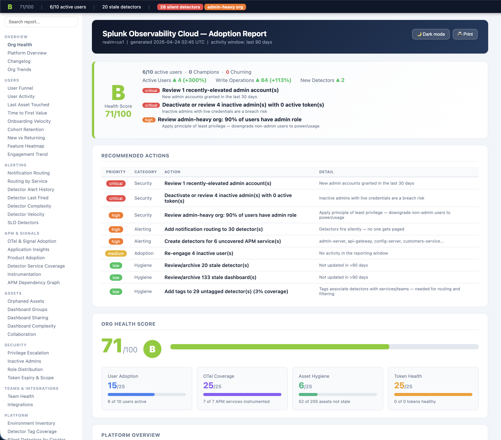

# o11y-adoption

Audit tool for Splunk Observability Cloud adoption. Answers:
- **Who** is using the platform and how actively?
- **How much** OpenTelemetry instrumentation has been adopted?
- **What** assets (detectors, dashboards, tokens) are stale or unhealthy?

> **Note on data availability:** The Splunk Observability audit API logs write operations (POST/PUT/DELETE) only — dashboard views and chart reads are not recorded. Time-on-page and view counts are not derivable from any available API. The tool maximizes what can be inferred from login events, write activity, and asset metadata.

## Data sources

| Source | What it provides |
|--------|-----------------|
| `GET /v2/organization/member` | Full user roster, roles, join date |
| `GET /v2/team` | Team membership |
| `GET /v2/event/find?query=sf_eventType:SessionLog` | Login/logout events — email, auth method, tokenId, timestamps |
| `GET /v2/event/find?query=sf_eventType:HttpRequest` | Write-only audit events — resource type, method, URI, timestamp |
| `GET /v2/detector`, `/v2/dashboard`, `/v2/chart` | Asset inventory, staleness, last-modified-by |
| `GET /v2/token` | Token expiry / health |
| `GET /v2/dimension?query=key:telemetry.sdk.*` | OTel SDK language and version signals |
| `GET /v2/dimension?query=key:telemetry.sdk.name` | OTel SDK name (opentelemetry, beyla, etc.) |
| `GET /v2/dimension?query=key:otelcol*` | OTel Collector presence |
| `GET /v2/dimension?query=key:deployment.environment` | Deployment environments |
| `GET /v2/dimension?query=key:service.name` | Per-service language (via `customProperties.telemetry.sdk.language`) |
| `POST /v2/apm/topology` | APM service graph: nodes (real + inferred), edges (call relationships) |

## Setup

```bash
git clone https://github.com/mqbui1/o11y-adoption
cd o11y-adoption
pip install -r requirements.txt

export SPLUNK_REALM=us1
export SPLUNK_ACCESS_TOKEN=<your-api-token>
```

## Commands

### `report` — full adoption report

```bash
python3 o11y_adoption.py report [options]
```

Prints a full report with the following sections (in order):

| Section | What it shows |
|---------|---------------|
| **Org health score** | 0–100 score with progress bars: user adoption, OTel coverage, asset hygiene, token health |
| **Platform overview** | User counts, detector/dashboard/chart totals, token health summary |
| **OTel & signal adoption** | APM service count, SDK-instrumented services, Collector deployments, language breakdown |
| **Application insights** | Service inventory (name, language, call relationships), inferred dependencies (databases, external HTTP), deployment environments, stack type fingerprinting, hub services (most-called) |
| **User activity table** | All users with engagement score (0–100), last login, last activity, login count, write ops |
| **Login frequency timeline** | Logins per calendar week per user |
| **Login heatmap** | Org-wide logins by day-of-week × hour-of-day (UTC) |
| **Write activity detail** | Per-user API mutations grouped by method+resource, plus 5 most recent ops |
| **Asset ownership** | Detectors, dashboards, charts attributed to each user by `lastUpdatedBy` |
| **Team rollup** | Members, active count, avg engagement score, asset counts per team |
| **Detector health issues** | Detectors flagged for: no notifications configured, disabled |
| **Token attribution** | Tokens seen in login events — identifies shared tokens (used by multiple users) |
| **Inactive users** | Users with no login or write activity in the lookback window |
| **Token alerts** | Expired and soon-to-expire tokens |
| **Stale detectors** | Detectors not updated in `--stale-days` |
| **Application insights** | Service inventory by type/language, dependency graph, inferred deps (databases, external HTTP), environment breakdown, stack type fingerprinting |
| **Stale dashboards** | Dashboards not updated in `--stale-days` |

**Options:**

| Flag | Default | Description |
|------|---------|-------------|
| `--days N` | 90 | Activity lookback window in days |
| `--since YYYY-MM-DD` | — | Start date (overrides `--days`) |
| `--until YYYY-MM-DD` | now | End date (use with `--since`) |
| `--stale-days N` | 90 | Mark assets stale if not updated in N days |
| `--no-otel` | off | Skip OTel Dimension API scan (faster) |
| `--no-teams` | off | Skip team rollup section |
| `--no-cache` | off | Force fresh API fetch, bypass local cache |
| `--csv` | off | Save user activity table to `reports/adoption_users_<ts>.csv` |
| `--html` | off | Save full report as HTML to `reports/adoption_report_<ts>.html` |
| `--json` | off | Save full raw data to `reports/adoption_report_<ts>.json` |
| `--baseline PATH` | — | Path to a previous `--json` snapshot for changelog diffing |

### `users` — user activity only

```bash
python3 o11y_adoption.py users [options]
```

Lightweight fetch — skips assets, OTel signals, and teams. Prints user activity table with engagement scores.

| Flag | Default | Description |
|------|---------|-------------|
| `--days N` | 90 | Activity lookback window |
| `--since YYYY-MM-DD` | — | Start date (overrides `--days`) |
| `--until YYYY-MM-DD` | now | End date |
| `--inactive-only` | off | Show only users with no activity in the window |
| `--csv` | off | Save results to `reports/adoption_users_<ts>.csv` |

### `tokens` — token health only

```bash
python3 o11y_adoption.py tokens
```

Lists all tokens with expiry status and auth scopes. Flags expired and expiring-soon tokens.

### `activity-timeline` — per-user event log

```bash
python3 o11y_adoption.py activity-timeline --user <email> [options]
```

Prints a chronological timeline of all logins and write operations for a specific user.

| Flag | Default | Description |
|------|---------|-------------|
| `--user EMAIL` | required | User email to show timeline for |
| `--days N` | 90 | Lookback window |
| `--since YYYY-MM-DD` | — | Start date (overrides `--days`) |
| `--until YYYY-MM-DD` | now | End date |

Example output:
```
  Activity timeline for mbui@splunk.com  (8 events)

  Timestamp              Action   Resource/Detail
  ----------------------------------------------------------------------
  2026-04-01 15:54 UTC   LOGIN    SSO_PROVIDER
  2026-04-01 15:54 UTC   POST     /v2/team
  2026-04-01 15:54 UTC   POST     /v2/token
  2026-04-06 05:37 UTC   PUT      /v2/token/mqbtesting-INGEST
  2026-04-06 05:38 UTC   PUT      /v2/token/_RLITHH7C8nIXRJOG4KYuQ
```

## HTML report

```bash
python3 o11y_adoption.py report --html
# → reports/adoption_report_<timestamp>.html
```

Self-contained single-file HTML report (no external dependencies, works offline).

**Report sections:**

| Section | Contents |
|---------|----------|
| Executive Summary | Health grade (A–F), score/100, active users, Champions/Churning count, top 3 actions |
| Recommended Actions | Prioritised action list with category and detail |
| Org Health Score | Overall score + 4 dimension cards: User Adoption, OTel Coverage, Asset Hygiene, Token Health |
| User Activity | Per-user engagement score bar, last login, write ops, TTFV, feature areas, API vs UI split |
| Team Rollup | Team-level activity aggregation: members, active count, avg score |
| OTel / APM Coverage | APM service map, per-service environment coverage, SDK languages |
| Detector Health | Detectors with issues: no notifications, disabled, always-muting |
| Token Attribution | Token → user mapping with scope and shared-token flags |
| Stale Assets | Detectors and dashboards not updated in >90 days |
| … 30+ more sections | Alert fatigue, incident MTTA, dashboard complexity, cardinality hotspots, etc. |

**Report features:**
- Sidebar navigation with search — jump to any section instantly
- Sticky summary bar — grade, active users, stale assets always visible
- Dark / light mode toggle
- Sortable tables (click any column header)
- Collapsible sections — expand/collapse each card
- Print-friendly layout

**Sample layout:**

```
┌─────────────────────────────────────────────────────────────────────────────┐
│ [sticky bar]  B  66/100  |  6/10 active users  |  20 stale detectors       │
├──────────┬──────────────────────────────────────────────────────────────────┤
│ Sections │  Splunk Observability Cloud — Adoption Report          [🌙][🖨] │
│ [search] │  realm=us1 | generated 2026-04-23 | activity window: last 90d    │
│          │                                                                   │
│ Exec Sum │  ┌─ B  66/100 ──────────────────────────────────────────────────┐│
│ Actions  │  │  6/10 active  ·  0 Champions  ·  0 Churning                  ││
│ Health   │  │  ▲ Active Users +300%  ▲ Write Ops +110%                      ││
│ Users    │  │  [critical] Review 1 recently-elevated admin                  ││
│ Teams    │  │  [critical] Deactivate 4 inactive admins with 8 live tokens   ││
│ OTel     │  └──────────────────────────────────────────────────────────────┘│
│ APM      │                                                                   │
│ Detectors│  ▼ Org Health Score                66/100  B                     │
│ Tokens   │    User Adoption  15/25  ████████░░  6 of 10 active              │
│ Stale    │    OTel Coverage  25/25  ██████████  7 of 7 services instrumented│
│ ...      │    Asset Hygiene   6/25  ███░░░░░░░  52 of 204 assets not stale  │
│          │    Token Health   20/25  █████████░  8 of 10 healthy             │
│          │                                                                   │
│          │  ▼ User Activity (sortable, 90d window)                          │
│          │    Email          Score  Last Login    Logins  Writes  TTFV  Tag │
│          │    mbui@splunk    92/100  2026-04-22       9      46    2d  Champ │
│          │    gravi@splunk   32/100  2026-04-11       3       0    —   View  │
└──────────┴───────────────────────────────────────────────────────────────────┘
```

### How to read the HTML report

Open the `.html` file from `reports/` in any browser — no server required.

#### Navigation

- **Sticky bar** (top) — health grade, score/100, and the four dimension sub-scores always visible while scrolling
- **Sidebar** (left) — jump to any section; type in the search box to filter cards by keyword
- **Dark mode / Print** — buttons in the top-right of the header

#### Section by section

**Executive Summary**

The large letter grade. Score is composed of four equal dimensions (25 pts each):

| Dimension | What it measures |
|-----------|-----------------|
| **User Adoption** (blue) | Active users ÷ total users |
| **OTel Coverage** (purple) | APM services with OTel SDK ÷ total APM services |
| **Asset Hygiene** (green) | Non-stale assets ÷ total detectors + dashboards |
| **Token Health** (amber) | Healthy tokens ÷ total tokens (penalises expired + expiring <7d) |

Grade: A ≥80 · B ≥65 · C ≥50 · D ≥35 · F <35

The summary also shows Champions (high-engagement users) and Churning (users whose score dropped significantly) counts, and the top 3 recommended actions.

**Recommended Actions**

Prioritised list of the highest-impact things to do — inactive admins, broken notification channels, expiring tokens, uninstrumented services.

**Org Health Score**

The four dimension cards with progress bars showing exact scores and the counts behind them (e.g. "6 of 10 users active").

**Platform Overview**

Snapshot stat tiles: active/total users, detector/dashboard/chart counts, token count, stale detector and dashboard counts (red).

**OTel & Signal Adoption**

How much of your APM fleet is instrumented, which languages/SDKs are in use, whether an OTel Collector is deployed.

**Application Insights**

Per-service breakdown from the APM topology graph:
- **Stack type** — inferred from language distribution (e.g. "Java microservices")
- **Hub services** — highest in-degree nodes (API gateways, shared libs)
- **Inferred dependencies** — databases and external HTTP endpoints detected as uninstrumented topology nodes
- **Environments** — all `deployment.environment` values seen in traces

**User Activity**

One row per user. Key columns:

| Column | What it means |
|--------|--------------|
| **Score / Δ30d** | Engagement score (0–100) and change over 30 days |
| **Last Login / Activity** | Recency signals |
| **Logins / Reads / Writes** | Volume of interactions in the window |
| **Avg Session** | Mean session length |
| **API%** | Fraction of activity via API vs UI — high = power user or automation |
| **TTFV** | Time to First Value — days from account creation to first meaningful action |
| **Det / Dash / Charts** | Asset counts owned by this user |
| **Top Features** | Product areas used most frequently |

User tags: **Champion** (score ≥80, consistent activity), **Churning** (score dropped >30pts), **Power User** (high write activity), **View Only** (logins but no writes), **At Risk** (declining engagement).

**Team Rollup**

Same metrics aggregated by team tag — active member count, average score, total writes, asset counts. Use this to compare adoption across teams.

**Detector Health Issues**

Detectors flagged for problems: no notification routing configured, disabled, never fired, always-muting, stale (not updated in >90 days), no tags. Each flag category is a separate signal — a detector that never fires and has no notifications is silently broken.

**APM Dependency Graph**

Interactive bubble graph of service-to-service call relationships. Node size = call volume, red fill = service has active errors. Shows which services are true hubs vs leaf nodes.

**Feature Heatmap**

Grid of users × product features. Dark cell = heavy use, empty = never used. Identifies adoption gaps by feature area or team.

**Alert Severity Distribution**

Breakdown of fired alerts by severity. A healthy distribution has mostly Warning/Minor with few Critical — inverted distributions (mostly Critical) suggest detectors are mis-tuned.

**Alert Fatigue**

Detectors firing too frequently — likely causing engineers to ignore them. Sorted by firing rate descending.

**Notification Channel Health**

Whether PagerDuty, Slack, email, and other channels are reachable. Broken channels mean alerts are silently not delivered.

**Token Expiry & Scope Audit**

Tokens expiring soon or already expired, plus tokens with more scopes than necessary. Expired tokens break integrations; over-scoped tokens are a security risk.

**Orphaned Assets**

Detectors, dashboards, and charts whose creator no longer exists in the org. Effectively unowned — no one will respond when they alert or notice when they go stale.

**Onboarding Velocity / TTFV**

How quickly users in each cohort (month of joining) reached their first meaningful action. A shortening TTFV trend means onboarding is improving.

**Asset Age Distribution**

Histogram of detector and dashboard ages. A large spike of very old assets suggests accumulated technical debt and detectors alerting on obsolete signals.

**Report Changelog**

Diff vs the previous snapshot — new users, changed scores, new assets, resolved/new issues. Useful for weekly standups and sprint reviews.

---

## Sample report



## Example terminal output

```
==============================================================================================================
  Splunk Observability Adoption Report  |  realm=us1  |  2026-04-24 03:41 UTC
  Activity window: last 90 days  |  Stale threshold: >90 days since last update
==============================================================================================================

  ORG HEALTH SCORE
  ──────────────────────────────────────────────────
  Overall:  ██████████████░░░░░░  71/100  (B)

  User adoption    ██████░░░░    15/25   6 of 10 users active in last 90d
  OTel coverage    ██████████    25/25   7 of 7 APM services OTel-instrumented
  Asset hygiene    ███░░░░░░░     6/25   52 of 205 detectors+dashboards not stale
  Token health     ██████████    25/25   1 of 1 tokens healthy

  PLATFORM OVERVIEW
  ──────────────────────────────────────────────────
  Users (total):         10
  Users (active 90d):    6
  Users (inactive):       4

  Detectors:     30  (10 active, 20 stale >90d)
  Dashboards:   175  (42 active, 133 stale >90d)
  Charts:      1000

  Tokens:         1  (0 expiring <7d, 0 expiring <30d, 0 expired)

  OTEL & SIGNAL ADOPTION
  ──────────────────────────────────────────────────
  APM services (traces):           7  admin-server, api-gateway, config-server, customers-service, discovery-server, vets-service...
  OTel SDK instrumented:           7  (= APM topology count)
  OTel Collector:                     yes
  SDK languages detected:             dotnet, generic, go, java, nodejs, python
  SDK names detected:                 beyla, opentelemetry, opentelemetry-ebpf-instrumentation

  APPLICATION INSIGHTS
  ──────────────────────────────────────────────────────────────────────────
  Environments (41 total):
    Production:  production
    Dev:         dev
    Other:       demo, lab, test, unknown
    Workshop:    30 envs

  Stack types:     Java microservices, Python services, Node.js services, Go services, .NET/generic services, 1 database(s) detected
  Languages:       dotnet, generic, go, java, nodejs, python  (org-wide)

  Services (7):
    Name                   Environments
    ─────────────────────────────────────────────────────
    admin-server           production, dev, demo, lab, test, unknown, workshop (30 envs)
    api-gateway            production, dev, demo, lab, test, unknown, workshop (30 envs)  ★ hub
    config-server          production, dev, demo, lab, test, unknown, workshop (30 envs)
    customers-service      production, dev, demo, lab, test, unknown, workshop (30 envs)
    discovery-server       production, dev, demo, lab, test, unknown, workshop (30 envs)
    vets-service           production, dev, demo, lab, test, unknown, workshop (30 envs)
    visits-service         production, dev, demo, lab, test, unknown, workshop (30 envs)

  Inferred dependencies:
    mysql:petclinic        [database]
    localhost:8888         [service]

  PRODUCT ADOPTION COVERAGE  (1/7 products active)
  ──────────────────────────────────────────────────────────────────────
  ✓  APM / Tracing                   35 service(s) sending traces
  ✗  Infrastructure Monitoring       No AWS/GCP/Azure/K8s integrations configured
  ✗  RUM                             No RUM activity detected
  ✗  Log Observer                    No Log Observer activity
  ✗  Synthetics                      No Synthetics activity
  ✗  Profiling                       No profiling SDK detected
  ✗  Alerting / On-Call              No notification integrations configured

  DETECTOR SERVICE COVERAGE  1/7 services covered (14%)
  ────────────────────────────────────────────────────────────
  Uncovered: admin-server, api-gateway, config-server, customers-service, discovery-server, vets-service

  ENGAGEMENT TREND  (last 30d vs prev 30d)
  ──────────────────────────────────────────────────────────────────────
  User                     Tag              Prev30  Last30   Delta
  ──────────────────────────────────────────────────────────────────────
  mbui@splunk.com          Power Builder        38      64 ▲    26
  ayaseen@splunk.com       Active                0       1 ▲     1
  gravi@splunk.com         Active                1       1 →     0
  sde@splunk.com           Active                1       1 →     0

  USER ACTIVITY  (last 90 days)
  ──────────────────────────────────────────────────────────────────────
  User                                 Score  Last Login             Last Activity           Logins  Writes  Resources Used
  ──────────────────────────────────────────────────────────────────────────────────────────────────────────────
  mbui@splunk.com [admin]              70/100  2026-03-25 03:37 UTC   2026-04-23 18:56 UTC         8      94  team, token
  gravi@splunk.com                     30/100  2026-04-22 17:44 UTC   2026-04-22 17:44 UTC         2       0  —
  ayaseen@splunk.com [admin]           28/100  2026-04-21 15:09 UTC   2026-04-21 15:09 UTC         1       0  —
  sde@splunk.com [admin]               30/100  2026-04-13 14:06 UTC   2026-04-13 14:06 UTC         2       0  —
  ekalosakenyon@splunk.com [admin]      2/100  never                  never                        0       0  —
  samx@splunk.com [admin]               2/100  never                  never                        0       0  —

  LOGIN FREQUENCY  (logins per calendar week)
  ──────────────────────────────────────────────────────────────────────
  User                                 W04  W05  W08  W09  W10  W11  W12  W15  W16
  ──────────────────────────────────────────────────────────────────────────────────
  mbui@splunk.com [admin]                .    .    1    2    .    2    3    .    .
  gravi@splunk.com                       .    .    .    .    1    .    .    .    1
  ayaseen@splunk.com [admin]             .    .    .    .    .    .    .    .    1
  sde@splunk.com [admin]                 .    .    .    1    .    .    .    1    .

  LOGIN HEATMAP  (org-wide logins by day/hour UTC)
  ──────────────────────────────────────────────────────────────────────
  Day   00 01 02 03 04 05 06 07 08 09 10 11 12 13 14 15 16 17 18 19 20 21 22 23
  ───────────────────────────────────────────────────────────────────────────────
  Mon    .  .  .  .  1  .  .  .  .  .  .  .  .  .  1  .  1  .  1  .  .  .  .  .
  Tue    .  .  .  .  .  1  .  .  .  .  .  .  .  .  .  1  .  1  .  .  .  .  .  .
  Wed    .  .  .  1  .  .  .  .  .  .  .  .  .  .  .  .  .  1  1  .  1  .  .  .
  Thu    .  .  .  .  2  .  .  .  .  .  .  .  .  .  .  .  .  .  .  1  .  .  .  .
  Fri    .  .  .  .  .  .  .  .  .  .  .  .  .  .  .  1  .  .  .  .  .  .  .  .
  Sat    .  .  .  .  1  .  .  .  .  .  .  .  .  .  .  .  .  .  .  .  .  .  .  .

  FEATURE AREA USAGE  (API resource types, org-wide)
  ──────────────────────────────────────────────────────────────────────
  token                           ██████████████░░░░░░      72 requests
  team                            ████░░░░░░░░░░░░░░░░      22 requests

  USER COHORT RETENTION  (grouped by join month)
  ──────────────────────────────────────────────────────────────────────
  Cohort         Size  Active  Retention
  ───────────────────────────────────────
  2025-03           1       1       100%
  2025-12           1       1       100%
  2026-01           5       2        40%
  2026-02           1       0         0%
  2026-03           1       1       100%
  2026-04           1       1       100%

  ORG ACTIVITY TREND  (combined logins + API events by month)
  ──────────────────────────────────────────────────────────────────────
  2026-01  ░░░░░░░░░░░░░░░░░░░░░░░░░░░░░░  1
  2026-02  █░░░░░░░░░░░░░░░░░░░░░░░░░░░░░  2
  2026-03  ██████████████░░░░░░░░░░░░░░░░  48
  2026-04  ██████████████████░░░░░░░░░░░░  59
```

## Scoring

### Org health score (0–100)

| Dimension | Weight | Formula |
|-----------|--------|---------|
| User adoption | 25 pts | `active users / total users` |
| OTel coverage | 25 pts | `SDK-instrumented services / total APM services` |
| Asset hygiene | 25 pts | `non-stale assets / total detectors+dashboards` |
| Token health  | 25 pts | `healthy tokens / total tokens` (penalises expired + expiring <7d) |

Grade: A ≥80, B ≥65, C ≥50, D ≥35, F <35

### User engagement score (0–100)

| Component | Weight | Formula |
|-----------|--------|---------|
| Recency | 30 pts | Linear decay from last activity date to window start |
| Login cadence | 25 pts | Actual logins vs target of 1/week over the window |
| Write activity | 25 pts | Log scale — 50 write ops = full score |
| Asset footprint | 20 pts | Log scale — 20 owned assets = full score |

## What counts as "active"

| Signal | Source | Notes |
|--------|--------|-------|
| Login | `SessionLog` event with `action=session created` | Includes SSO and password auth |
| API write activity | `HttpRequest` event with method POST/PUT/DELETE | Only mutations are logged; GET requests are not audited |
| Asset ownership | `lastUpdatedBy` on detector/dashboard/chart objects | Reflects who last saved the asset, not who created it |
| Login frequency | Count of `SessionLog` events grouped by calendar week | |
| Token sharing | `tokenId` in `SessionLog` cross-referenced with token objects | Identifies shared vs personal tokens |

## OTel detection logic

OTel signals are detected via the **Dimension API** (`GET /v2/dimension`), not via MTS queries. The Splunk Java agent and OTel SDKs store instrumentation metadata as dimension-level properties, not as metric time series dimensions.

| Signal | API query | What it means |
|--------|-----------|---------------|
| SDK languages in use | `key:telemetry.sdk.language` | Values: `java`, `python`, `go`, `nodejs`, etc. |
| SDK names | `key:telemetry.sdk.name` | Values: `opentelemetry`, `beyla`, `opentelemetry-ebpf-instrumentation` |
| OTel Collector present | `key:otelcol*` | Any result = Collector deployed |
| Instrumented service count | APM topology node count | Services sending traces = instrumented |

> **Why not MTS dimensions?** The Splunk Java agent and OTel SDKs attach `telemetry.sdk.*` as resource attributes on spans, not as dimensions on metric time series. Querying `/v2/metrictimeseries` for these keys returns zero results even in fully instrumented environments.

## Application insights

The `report` command includes an **Application Insights** section that answers "what types of applications are being onboarded?" using three data sources:

| Signal | API | What it shows |
|--------|-----|---------------|
| Service inventory | `POST /v2/apm/topology` | All instrumented services (real) + inferred dependencies (databases, external HTTP) |
| Per-service language | `GET /v2/dimension?query=key:service.name` | `customProperties.telemetry.sdk.language` on each service dimension |
| Environments | `GET /v2/dimension?query=key:deployment.environment` | All deployment environments (production, staging, dev, etc.) |
| Dependency graph | APM topology edges | Which services call which — used to identify hub/gateway services |

### What it detects

| Insight | How |
|---------|-----|
| **Stack type** | Infers "Java microservices", "Python services", "Node.js services", etc. from language distribution + service count |
| **Database dependencies** | APM topology inferred nodes with `type=database` — shows name (e.g. `mysql:petclinic`) |
| **Hub services** | Services with highest in-degree (most called by others) — likely API gateways or shared libs |
| **Environments** | Dimension API returns all `deployment.environment` values seen in traces |
| **Language per service** | Cross-references `service.name` dimension `customProperties` for `telemetry.sdk.language` |

## Known limitations

- **No read/view tracking** — the audit API only records write operations. Dashboard views, chart views, and SignalFlow executions are not logged and cannot be derived from any available API.
- **Asset ownership = last modifier** — `lastUpdatedBy` reflects who last saved an asset, which may differ from the original creator.
- **System assets** — assets created by Splunk's built-in content system appear under a system user ID (e.g. `AAAAAAAAAAA`) rather than an email.
- **Team members** — team membership is fetched from `GET /v2/team` but member IDs are only resolved to emails for users present in the org member list.
- **HttpRequest events** — only user-initiated API calls are captured; automated token/integration calls appear under their token's associated user if resolvable.
